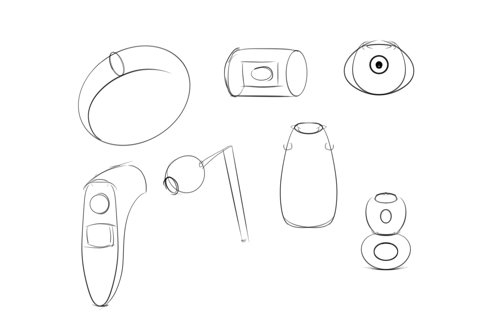
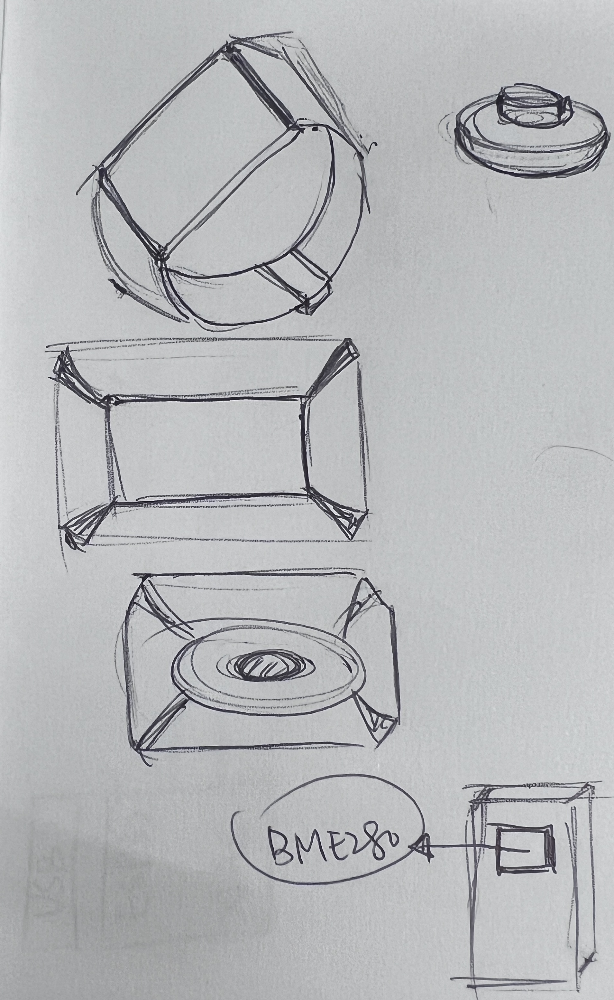
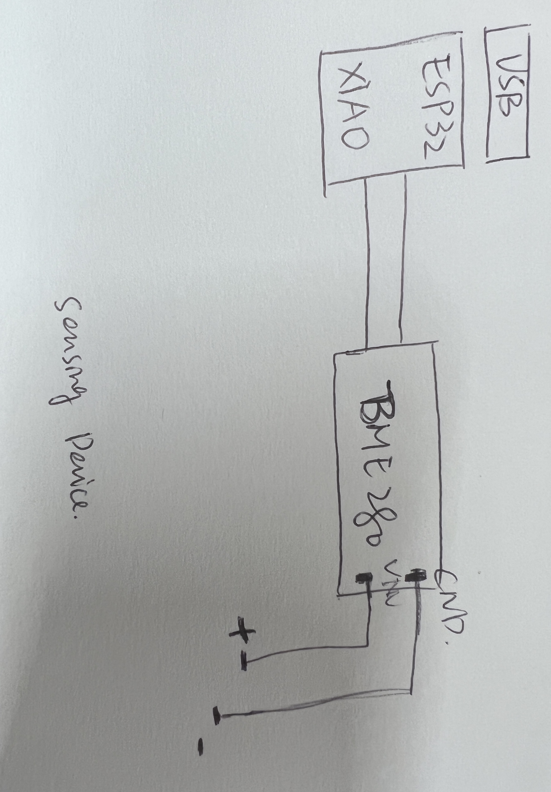
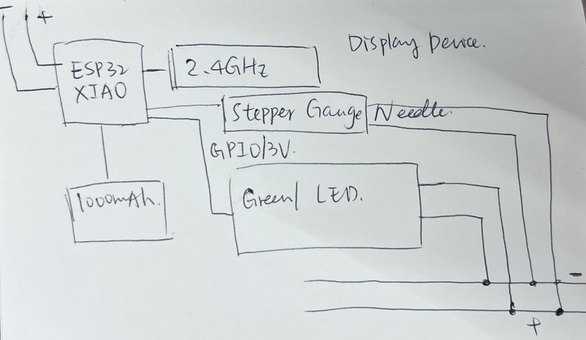
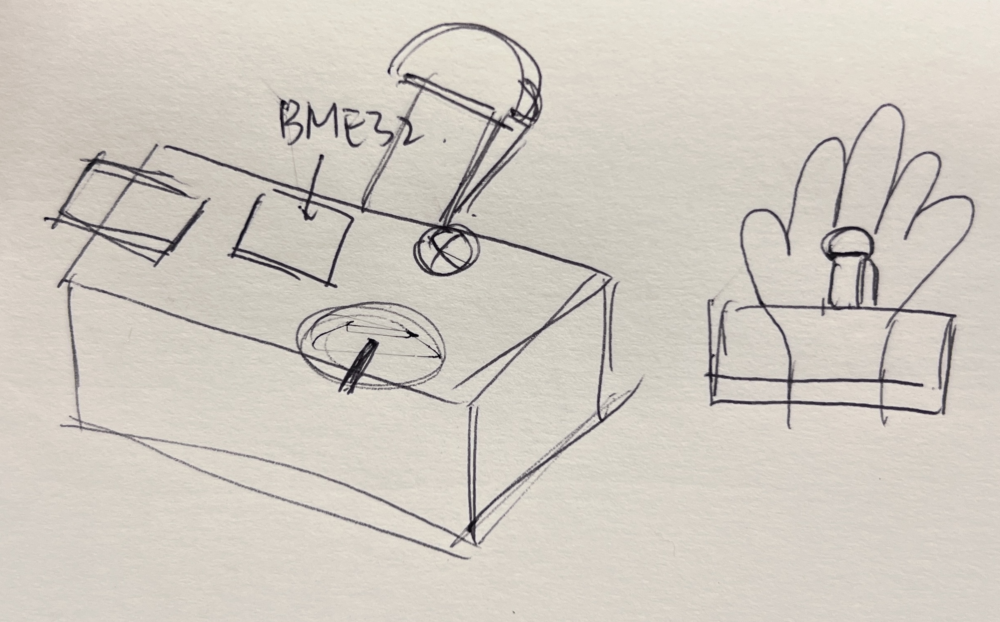
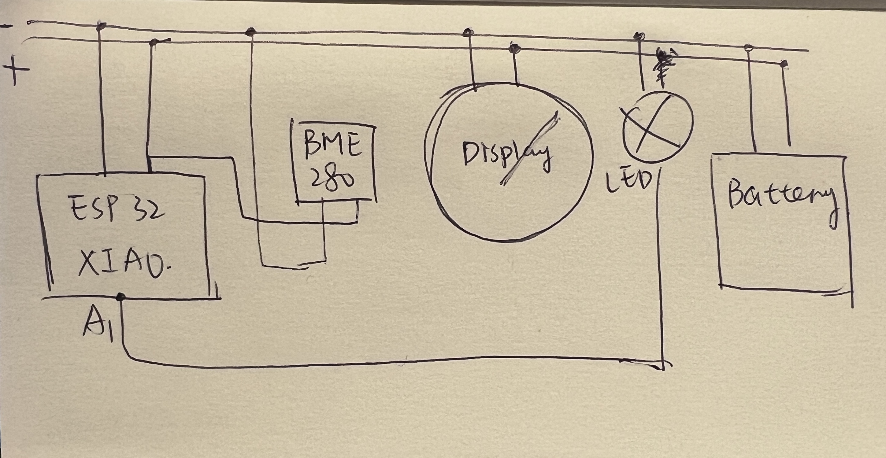

# TECHIN514_Final_Project

# Cooking Oil Temperature Detector
This is a wearable oil temperature detector for real-time monitoring of oil temperature while cooking. When the oil temperature reaches about 180°C, the LED lights up to remind you that you can cook (for example, frying a steak). The device uses a sensor (BME280) to detect the temperature and displays the oil temperature through the stepper motor pointer.
General Sketch:

# Sensor Device
Sensing Device: one BME 280, one APDS-9960(optional)
The BME280 sensor can measure the oil temperature, and when it reaches approximately 180 degrees, it is the ideal time to add the steak. Additionally, the APDS-9960 proximity sensor can help remind you to maintain a safe distance from the pan to avoid burns.
  

# Display Device
one Stepper motor-driven gauge needle and lights the LED when the temperature reaches a threshold

# Devices communicate with each other and a detailed diagram 
ESP32 collects raw data of temperature from BMP280, which communicates measurements to the ESP32 via an I²C (or SPI) interface. The ESP32 calculates the corresponding needle position based on the measured temperature, giving the user an intuitive visual effect.

How devices communicate:

How it works:

