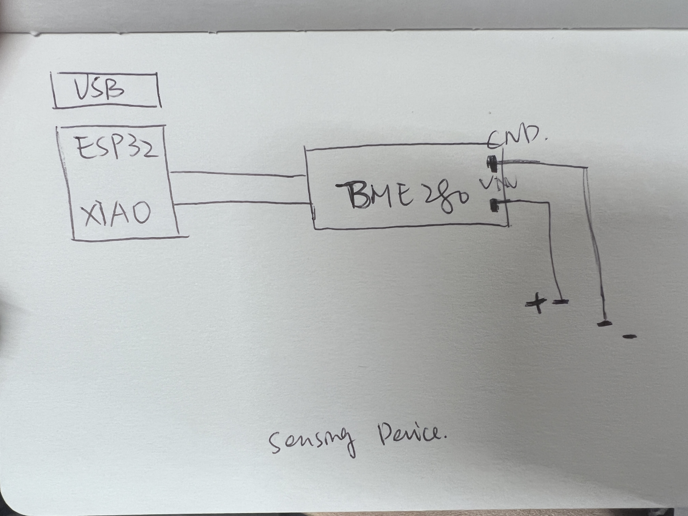

# TECHIN514_Final_Project

# Cooking Oil Temperature Detector
This is a wearable oil temperature detector for real-time monitoring of oil temperature while cooking. When the oil temperature reaches about 180°C, the LED lights up to remind you that you can cook (for example, frying a steak). The device uses a sensor (BME280) to detect the temperature and displays the oil temperature through the stepper motor pointer.
General Sketch:

# Sensor Device
Sensing Device: BME 280 
 
 
